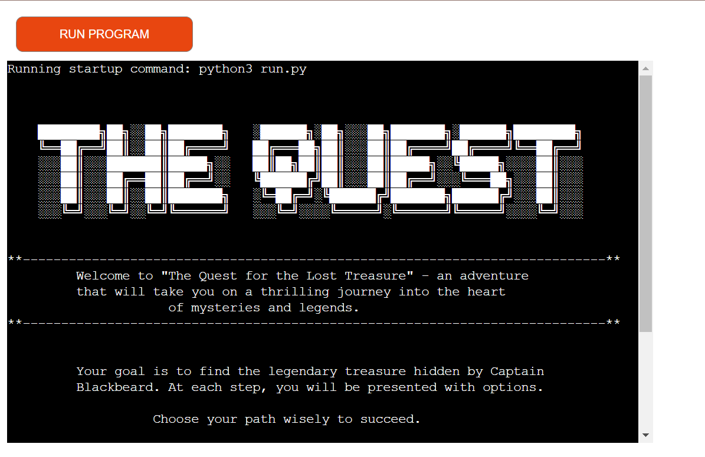

# The Quest For The Lost Treasure

# Purpose 

"The Quest for the Lost Treasure" is a command-line terminal text-based adventure game developed in Python. Embark on a thrilling journey through mysterious lands and uncover lost treasures in this adventure game that will put your decision-making skills to the test. 

It is an interactive game where you take on the role of a daring adventurer on a mission to uncover the lost treasure hidden centuries ago. Your decisions and choices will determine the outcome of your quest, and the path you choose to follow will lead to various encounters, puzzles and, ultimately, the treasure's location. The game has multiple success and failure endings. The target audience is everyone who like to play games and are fan of adventure games.

- The game is build using Python as a Milestone Project#3 for the Code Institute's Full Stack Software
  Development Course.

-------

# User Experience (UX) and Design

## User Stories

## Design
### Data Model
### Flowchart

## Tools and Technologies

## Version Control

The website was developed through Codeanywhere IDE.

- Git

  Code has been pushed to repository on Github with following git commands:

    - git add . - to add files ready to commit
    - git commit -m "message" - to commit the code to local repository ready to be pushed
    - git push - final command used to push committed code to remote repo on Github

## Imports

## Cloning the Repository

1. On Github navigate to the repository "gayatrig19/the-quest-adventures-game"
2. Click "Code" drop down menu - a green button shown right above the file list.
3. Copy the URL of the repository using "HTTPS", "SSH" or "Github CLI".
4. Open Git Bash.
5. Change the current working directory to the location where you want the cloned directory.
6. Type "git clone", and then paste the URL copied earlier.
7. Press enter to create local clone. A clone of the repository will now be created.

- For more details on how to clone the repository in order to create a copy for own use refer to the 
  site: <https://docs.github.com/en/repositories/creating-and-managing-repositories/cloning-a-repository>

