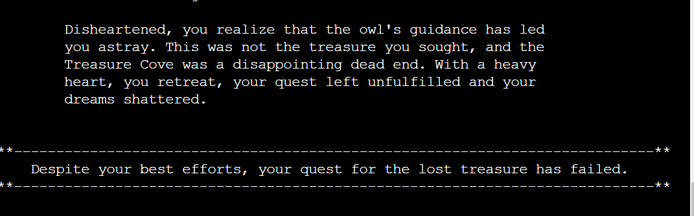

# The Quest For The Lost Treasure

# Purpose 

"The Quest for the Lost Treasure" is a Python command-line terminal text-based adventure game, which runs in the Code Institute mock terminal on Heroku. Embark on a thrilling journey through mysterious lands and uncover lost treasures in this adventure game that will put your decision-making skills to the test. 

It is an interactive game where you take on the role of a daring adventurer on a mission to uncover the lost treasure hidden centuries ago. Your decisions and choices will determine the outcome of your quest, and the path you choose to follow will lead to various encounters, puzzles and, ultimately, the treasure's location. The game has multiple success and failure endings. The target audience is everyone who like to play games and are fan of story based adventure games.

- The game is build in Python as a Milestone Project#3 for the Code Institute's Full Stack Software
  Development Course.

-------

# User Experience (UX) and Design

## User Stories

- As a user, I want to understand the purpose and intention of the site and application when I run
  the program.
- As a user, I want the navigation to be intuitive and easy to understand.
- As a user, I want to have an option to start the game.
- As a user, I want to be able to enter my name before I start to play the game.
- As a user, I would like to see a welcome message and my name added to storyline for more engaging
  experience.
- As a user, I want my input to be validated and error checked each time, so I can re-enter my
  input/choice if it is invalid.
- As a user, I should not have to worry about capitalizing or lowercase when typing.
- As a user I want the storyline and narrative to be coherent, engaging and well structured.
- As a user, I want to receive the next part in the story depending on the input choices.
- As a user, I want to reach the end of the game through one of the paths chosen, by either
  succeeding or failing in the game.
- As a user, I want see the final outcome of the game based on the choices made.
- As a user, I want to have an opportunity to play again regardless of success or failure in the game.
- As a user, I want to have engaging narrative with multiple paths to explore for success and failure
  outcomes.
- As a user, I want to be presented with choices throughout the game that allow me to choose my path
  based on story scenarios.

## Design

### Data Model

While implementing the project in Python, my primary focus was to incorporate Object Oriented Programming(OOP) Paradigms as the project necessity is functionality-centered. The mechanics, interactions, and story progression are implemented using text-based input and output. During discussion with my mentor, he guided me on how I can use data structures for storyline instead of opting for text-based iteration to keep code well-structured and organized utilising "Don't Repeat Yourself"(DRY) principle.

- Classes: I have used a single TreasureQuest Class containing story_description(dictionary)
  attribute and methods to initialize the game instance for the text-based adventure game using that  dictionary, encapsulating the game's functionality and story.

- Dictionaries: The story_description dictionary contains the game's storyline, choices, and outcomes
  structured as follows:
     - Keys: Strings representing different steps in the game.
     - Values: Dictionaries containing:
          1. "step_text": Text describing the current step.
          2. "options" (Dictionary): Available choices and their corresponding steps.
          3. "outcome": Outcome of the current step ("success" or "failure").

- Functions: To keep code readable and reusable, functions(play_game, display_intro, start_game,
  get_user_input) are  used to display the game's introduction and loop through the game's story, displaying text, options, and handle user choices, leading to different outcomes. 

- Input Validation: Each user input is validated and handled raising appropriate error depending on
  game stage and option to re-enter user input is provided if it is invalid.

- Separation of Concerns: Separated the game logic from the data(storyline) and the presentation
  (text-based input and output) to follow a good design practice and keep code well-maintained.

- The game defines various locations and sublocations, and the player can navigate through these  
  areas based on their choices. The game uses text-based print statements to provide descriptions, dialogues, and narrations to convey the story and set more engaging atmosphere.

### Flowchart

- Most of the text-based adventure games are primarily focused on providing user(player) with multiple
  paths and choices to explore before reaching to its' final outcome(either success or failure).

- The initial design for this project was simple with minimal paths with single nodes leading to win
   or lose outcomes. But I wanted the game to be more engaging such that players are presented with choices at various points in the game, and these choices lead to different story paths and outcomes.

- To achieve this the flowchart was redesigned number of times, and each time the story was modified
  for expected paths and choices until the point where it offered multiple endings, depending on the decisions the player makes throughout the game. These endings can vary in terms of success, failure and different story conclusions.

- The final flowchart design now showcase multiple paths with more engaging story narrative, offering 
  multiple success and failure outcomes. Though the end result is either success or failure, but based on the user choices, the game has different paths and scenarios to reach the end.

- For each step, the users receives a prompt to write their input, and the input is cross-checked
  against the code for validation. If the user input is invalid, they are given error feedback and prompted again to input on the same step. Once valid input is received, the user goes on to the next step.

- Regardless of the outcomes, user is provided option to play again, which either starts the game from
  beginning or exits depending on user choice.

- Below is the final flowchart design which can be followed to see all alternatives and their final
  outcomes.
   

# Features

## Existing Features

### Welcome Screen

- The main game title in ASCII text Art and a welcome message is shown when user hits the run program
  button. The welcome message is given a typewriter effect for a more game-immersive experience.
- User is provided with an overview about the game and a general idea on how to play the game.
- As it is a Python terminal based game, it is designed to be functionality-focused rather than 
  visually appealing. The structure though is designed keeping in mind the aspects of the game.

  

### Start Game Section

- Here user is prompted whether he wants to start the game, based on choices the game proceeds. If
  user has entered 'no' he is encouraged to play the game by providing a suitable feedback.
- The user can add their name to give them a personalised welcome to the game. The user's name is
  further used in the game story for providing player with a more personalized experience.

### Game Steps Section

- The user is then taken through a story with different scenarios and locations with detailed
  explanation of the journey and provided choices for the user to choose from which path they want to take. Choosing different paths can lead to different outcomes.

- Each story step is detailed and well-structured to give user an engaging adventure experience.

- The storyline is designed to keep each step interconnected and user is provided with two options to 
  choose from, based on the user choice the game paths can result in different outcomes. 

### Success and Failure Outcomes

- Based on user choices, there are multiple paths which can lead to either success or failure
  outcomes.
- The game is designed in such a way that user can explore multiple scenarios and locations based
  upon the choices resulting in either of the result.
- At the end of the user's journey, they are presented with a final text depending on their success or
  failure in the quest.

   - Success Text for the quest:
     
     

   - Failure Text for the quest:
     
     

- At the end, regardless of success or failure user is offered to play the game again. Based on the
  choice, the game either starts from the beginning or exits with a message.

  

## Future Implementations 
 
- To fix the identified bugs in the game.
- Add colours to text and imagery for visual effect.
- Expand the story for mutilpe levels(easy, medium and difficult) to give user more deep and
   immersive game experience.
- Use of google doc/ sheet to keep track of the number of players, their win and lose outcomes, a 
  form of leaderboard to display at the end of the game. This will give me opportunity to work with google spreadsheets to perform CRUD operations.

## Testing

- Note: This game will not work on mobiles as it runs on the mock terminal. (credit: Mock terminal created by Code Institute). No accessibilty or responsivity testing was therefore needed.

### Validator Testing

 - Python code is tested using Code Institute PYTHON LINTER, with no errors. Code passed through and  
   confirmed no problems.  

  - validated run.py file:
     
     

  
  - validated story.py file:

    

### Functional Testing
  

### Manual Testing:

- I tested the site in my local terminal and Code Institute Heroku Terminal.

- Input Validation:

The application is tested extensively for input validation. I have manually tested it by doing 
following:

- Proceed further with no input or input incorrect character/number for "Are you ready to play the 
  game" prompt.
     
    - Response: Receive an error message and prompt "Are you ready to play the game"(yes/no) again.

    
    

- Input username with less than 3 characters/ containing special characters/ proceed without entering 
  one:
   
    - Response: Error message is displayed based on the user action and a prompt to enter user name.

    

- Input incorrect choice other than 1 and 2 for "Enter your choice" prompt while playing the game for 
  different paths:

    - Response: Error message is displayed for invalid choice and user is prompted to enter the 
                choice again.

            

- At the end of the game, input incorrect character/ number/ press 'enter' with no input given for 
  "Would you like to play again" prompt.

    - Response: Receive an error message and prompt to enter the choice(yes/no) again.

    

 

## Tools and Technologies

## Version Control

The website was developed through Codeanywhere IDE.

- Git

  Code has been pushed to repository on Github with following git commands:

    - git add . - to add files ready to commit
    - git commit -m "message" - to commit the code to local repository ready to be pushed
    - git push - final command used to push committed code to remote repo on Github

## Imports

## Cloning the Repository

1. On Github navigate to the repository "gayatrig19/the-quest-adventures-game"
2. Click "Code" drop down menu - a green button shown right above the file list.
3. Copy the URL of the repository using "HTTPS", "SSH" or "Github CLI".
4. Open Git Bash.
5. Change the current working directory to the location where you want the cloned directory.
6. Type "git clone", and then paste the URL copied earlier.
7. Press enter to create local clone. A clone of the repository will now be created.

- For more details on how to clone the repository in order to create a copy for own use refer to the 
  site: <https://docs.github.com/en/repositories/creating-and-managing-repositories/cloning-a-repository>

## Forking

1. On Github navigate to the repository "gayatrig19/the-quest-adventures-game"
2. Click "Fork" located towards top right corner on GitHub page.
3. Select "owner" for the forked repository from the dropdown menu under "owner".
4. It will create forked repo under the same name as original by default. 
   But you can type a name in "Repository name" or add a description in "Description" box.
5. Click on "Create fork". A forked repo is created.

- Forking allows you to make any changes without affecting original project. You can send the
  the suggestions by submitting a pull request. Then the Project Owner can review the pull request before accepting the suggestions and merging them.
- When you have fork to a repository, you don't have access to files locally on your device, for 
  getting access you will need to clone the forked repository.
- For more details on how to fork the repo, in order to for example suggest any changes to the 
  project you can visit:<https://docs.github.com/en/get-started/quickstart/fork-a-repo>

## Deployment

- The web application is displayed and deployed using template provided by Code Institue to test the
  to test the code.

- The project is deployed on Heroku as follows:
1. Use: pip freeze > requirements.txt to add external libraries to deployed app.
2. Create Heroku account
3. In the top right, click 'New'
4. Click 'Create new app'
5. Give your app a name and select your region from drop down
6. Click 'Create new app'
7. Go to 'settings' tab, it's important you do it before deployment
8. Scroll down to 'config vars' section and key: PORT and value: 8000
9. Scroll down to 'Buildpacks' section
10. Click 'Add buildpack'
11. Add Python as first dependency and select 'Save changes'
12. Add node.js as a second dependency and save again (This is settings section done)
13. Select 'Deploy' tab at the top
14. Select 'Github' from 'Deployment method'
15. Type the name given to your project in Github and click 'search'
16. Scroll down and select Manual deployment method
17. You can also use Auto deployment method to allow the project to update every time you push the
    code.  
18. You can now click to view the app ready and running.

- For this project I used Manual deployment method to deploy the current state of the branch, every
  time I pushed the code from Codeanywhere.

